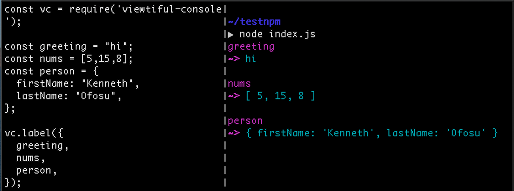

# Viewtiful-Console

A console alternative that will (eventually):

* wrap each environment's `console` object so that you can still use it and
* be thoroughly extensible so that I may profit (spiritually) from others' work.
  

### Okay, But What's There Now

This:




### Installation

In your terminal: 

```bash
npm install viewtiful-console
```
OR
```bash
yarn add viewtiful-console
```

Then in your JavaScript

```javascript
const vc = require('viewtiful-console'); // Or really call the variable whatever you want!

const someVariable = 'some value';
const anotherVariable = 'another value';
const severalValues = ['one', 'after', 'another'];

vc.label({someVariable}); // for just one value

// Several values serially:
vc.label({
  anotherVariable,
  severalVariables,
});
```


### Will There Be More?

Yes. Soon!

(-ish)
